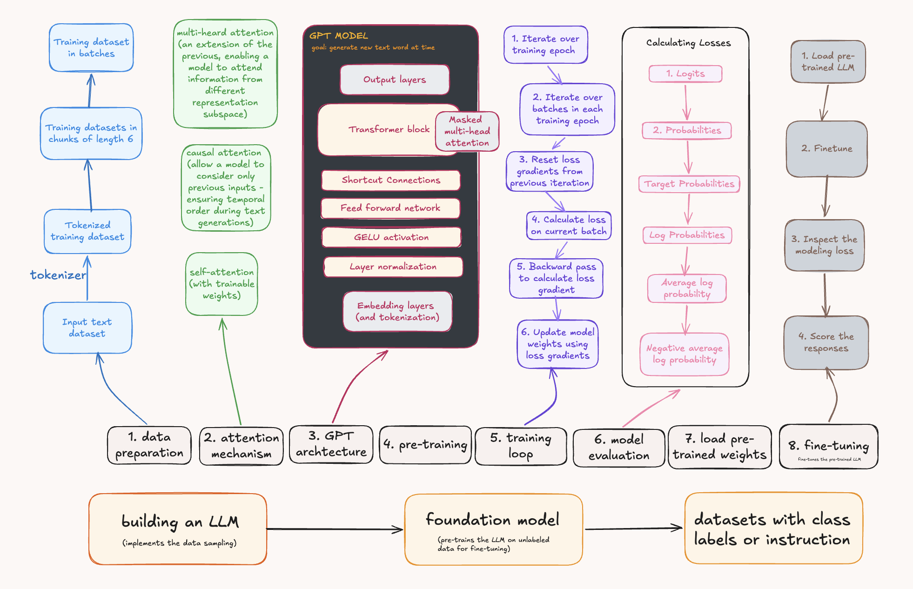

## 👾 my AI/ML algorithms && experiments

 

  

 

### chapters

 

#### large language models

* **[LLM from scratch](LLM-from-scratch)**
* **[RLHF techniques](RLHF-techniques)**

 

#### classic machine learning classifiers

* **[naive bayes vs. logistic regression](classic_ML_classifiers/naive_bayes_vs_logistic_regression)**
* **[adaboost](classic_ML_classifiers/adaboost)**
* **[kNN vs. SVM](classic_ML_classifiers/k-NN)**
* **[expectation maximization](classic_ML_classifiers/expectation_maximization)**
* **[hidden Markov model](classic_ML_classifiers/hidden_markov_model)**

 
